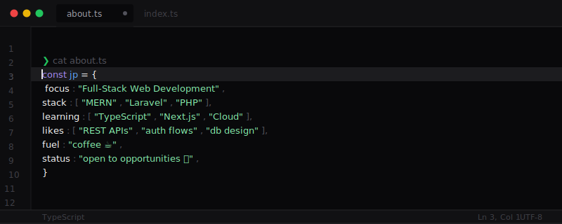

<table border="0" cellpadding="0" cellspacing="0" align="center">
  <tr>
    <td width="120" valign="middle">
      
    </td>
    <td valign="middle" padding="0 0 0 16px">
      <h2>JP Allam</h2>
      <p>Full-Stack Developer &nbsp;·&nbsp; MERN &nbsp;·&nbsp; Laravel &nbsp;·&nbsp; Open to opportunities</p>
      <p>
        <a href="https://yourwebsite.com"></a>
      </p>
    </td>
  </tr>
</table>

---



---

## stack


---

## projects

| project | description | stack |
|---------|-------------|-------|
| **MDRRMO Reporting System** | Reporting platform with auth, admin dashboard and mapping | Laravel |
| **Archiving** | Storage app for managing documents | Django |
| **Portfolio** | Personal space to showcase projects and experiments | React, Tailwind |

---

## github skills

```
7 / 7 completed
─────────────────────────────────────────────────
```


```
─────────────────────────────────────────────────
```
