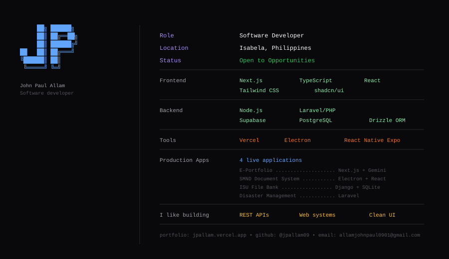

<table border="0" cellpadding="0" cellspacing="0" align="center">
  <tr>
    <td width="120" valign="middle">
      
    </td>
    <td valign="middle" style="padding: 0 0 0 16px">
      <h2>John Paul Allam</h2>
      
Software Developer &nbsp;·&nbsp; Next.js &nbsp;·&nbsp; React &nbsp;·&nbsp; Laravel &nbsp;·&nbsp; Open to opportunities

      

        
        
      

    </td>
  </tr>
</table>

---

---

## stack

---

## projects

| project | description | stack |
|---------|-------------|-------|
| **E-Portfolio** | Interactive portfolio with AI-powered chatbot responses using Gemini API. Live on Vercel. | Next.js, Gemini API, Tailwind |
| **SMND-Document Digitization Management System** | Desktop document management application for San Mateo North District. Enables categorization and search functionality for district staff. | React, Electron |
| **ISU San Mateo File Bank System** | Role-based file management system with permission-based access controls for university staff. Implemented document workflow management. Deployed on VPS. | Django, SQLite, MySQL |
| **Municipal Disaster Risk Reduction and Management System** | Disaster reporting system with emergency data entry and report generation features for municipal government. Deployed on VPS. | Laravel, MySQL |

---

## github skills

---

## GitHub Stats

### Overview
Overall contribution activity across public and private repositories.

### Consistency
Tracking daily commit streaks and long-term engagement.

### Technology Stack
Primary languages and frameworks used in recent projects.

---

